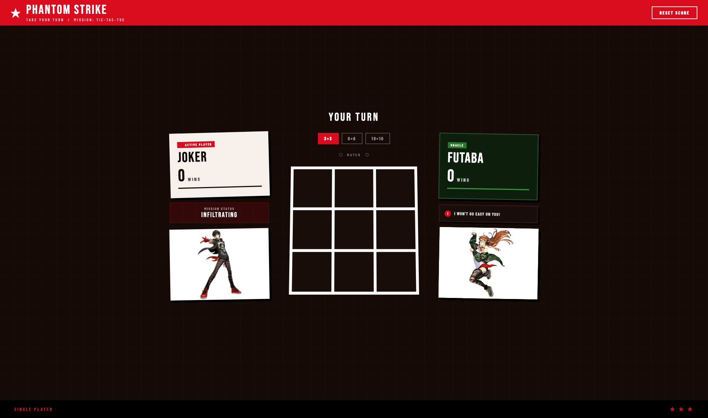

# Phantom Strike: Tic-Tac-Toe

A browser-based Tic-Tac-Toe game styled after Persona 5. Play as Joker against an AI opponent (Mona or Futaba) or against a friend on the same screen.



## Features

- **Two modes**
  - **PVE:** Joker vs an AI opponent
  - **PVP:** two players take turns on one device
- **Choose your opponent (PVE):** Mona, the Phantom Cat, or Futaba, the Oracle. Each has their own art, color theme and taunts.
- **Three board sizes, each with its own match rules:**

  | Board | To win a round | To win the match |
  |-------|----------------|------------------|
  | 3x3   | 3 in a row     | 1 round          |
  | 6x6   | 5 in a row     | 3 rounds         |
  | 10x10 | 5 in a row     | 5 rounds         |

- **Rule-based AI.** On each turn it does the first of these that applies:
  1. Completes a line to win.
  2. Blocks a line the player is about to complete.
  3. On 3x3, takes the center.
  4. Otherwise, scores every empty cell by how much it helps open lines and how close it is to the center, then plays the highest-scoring cell. Ties are broken at random.
- **Short AI "thinking" pause:** 0.9 s on 3x3, 0.6 s on 6x6 and 0.4 s on 10x10.
- Rows, columns and diagonals all count as wins. Draws are detected.
- Win and match-result animations, plus a score that stays until you reset it.

## Tech Stack

Vanilla JavaScript, HTML5 and CSS3. No build step and no dependencies.

## How to Play

1. Open `files/index.html` in a browser.
2. Pick a board size and a mode. In PVE, also pick an opponent.
3. Joker plays **X** and moves first. Get the required number in a row to win the round.

## Project Structure

```
files/
|-- index.html          # Page layout
|-- style.css           # Persona 5-style theme
|-- script.js           # Game logic, AI, match scoring
`-- character_pics/     # Character art
    |-- joker_pic.png
    |-- mona_pic.png
    `-- futaba_pic.png
docs/
`-- screenshot.png
```

## Credits

Special thanks to **[ATLUS](https://atlus.com/)** and **[SEGA](https://www.sega.com/)** for creating the Persona series. All credit for the original characters, artwork and style goes to them.

The art style is inspired by Persona 5 from the Persona series. I'm a big fan of the game! You guys should try out the Persona_5 game. You guys will LOVE IT!!!

Persona 5 and its characters (Joker, Mona, Futaba) belong to ATLUS and SEGA. This is a non-commercial fan project and is not affiliated with or endorsed by ATLUS or SEGA.

Official links:
- [Persona series official site](https://persona.atlus.com/)
- [Persona 5 Royal official site](https://persona.atlus.com/p5r/)
